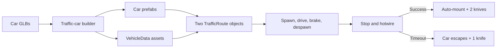

# Traffic implementation cheat sheet

> **Purpose:** the Unity-editor steps required to switch on the traffic and car-theft code that is
> already in this project. This is an operator checklist, not the canonical design specification.
> For behaviour and architecture, use
> [`TRAFFIC_AND_CAR_THEFT_PLAN.md`](TRAFFIC_AND_CAR_THEFT_PLAN.md) and
> [`CONSEQUENCES_AND_MOUNTS.md`](../reference/CONSEQUENCES_AND_MOUNTS.md).
>
> **Current state (checked 2026-08-20):** both car GLBs and all four traffic scripts are merged to
> `main` (PR #9). No generated traffic-car prefab, generated traffic `VehicleData`, or
> `TrafficRoute` is in `Home_London_Prefab` yet. The code and its hand-authored `.meta` files have
> still not been compiled or run in Unity.

## The short version

No new code is needed for the first implementation. In Unity you need to:

1. Let the project compile with no red Console errors.
2. Use **Tools > Place > Build Traffic Car Prefab** to turn the two supplied GLBs into traffic-car
   prefabs and data assets.
3. Open `Home_London_Prefab` in Prefab Mode and author two `TrafficRoute` objects, one in each
   direction.
4. Assign both cars, their spawn weights, and adult roaming villager presets to each route.
5. Save the prefab and run the play-test checklist below.



## 1. Preflight

- Exit Play Mode before authoring anything. Play-Mode Inspector changes are discarded when Play
  Mode stops.
- Open the project in Unity 2022.3 and wait for importing and compilation to finish.
- Open **Window > General > Console**. Resolve any red compiler/import errors before continuing.
- In the Project panel, confirm these source models exist and have imported as GameObjects:
  - `Assets/3DModels/Vehicles/car_1_reliant_robin.glb`
  - `Assets/3DModels/Vehicles/car_2_corsa.glb`

This first Unity open is itself a verification step: the traffic code and four hand-authored script
`.meta` files have never previously been accepted by a Unity editor.

## 2. Build the two car prefabs

1. Choose **Tools > Place > Build Traffic Car Prefab**.
2. The window should list both models. If it does not, click **Rescan models folder**.
3. Set the tiers before building:

   | Model | Tier |
   |---|---|
   | `car_1_reliant_robin` | **Common** |
   | `car_2_corsa` | **Better** |

4. Click **Build All** once. The tool processes every listed model in the same pass.
5. Read the dialog, then check the Console report for problems.

### Expected outputs with the current tool

The current filename cleaner retains the `1` and `2` portions of the model names. Unless the tool
is changed later, expect:

- `Assets/Prefabs/ModernBritain/TrafficCar_1ReliantRobin.prefab`
- `Assets/Prefabs/ModernBritain/TrafficCar_2Corsa.prefab`
- `Assets/Data/Vehicles/TrafficCar_1ReliantRobin_Data.asset`
- `Assets/Data/Vehicles/TrafficCar_2Corsa_Data.asset`

The older design plan names these without the numeric prefixes. That difference is only a filename
difference; use whatever Unity actually creates.

### Inspect the generated data

Select each generated `VehicleData` asset in the Project panel and confirm:

| Inspector field | Reliant Robin | Vauxhall Corsa |
|---|---:|---:|
| Vehicle Name | Reliant Robin | Vauxhall Corsa |
| Speed Multiplier | 3.0 | 3.75 |
| Traffic Speed | 7 | 8.5 |
| Hotwire Wires | 3 | 4 |
| Hotwire Seconds | 6 | 5 |
| Is Nickable | On | On |
| Keep Model Visible While Mounted | On | On |
| Chassis Prefab | matching generated prefab | matching generated prefab |

The tier choice matters only on the first build. The builder deliberately never overwrites an
existing prefab or data asset. If a tier was selected incorrectly, edit the generated
`VehicleData` fields in the Inspector; do not delete and rebuild an existing prefab.

### Inspect each generated prefab

Double-click each generated prefab and verify its root has:

- `BoxCollider`, sized around the bodywork;
- `Rigidbody` with **Is Kinematic** on and **Use Gravity** off;
- `Interactable`;
- `VehicleController`;
- `TrafficCar`;
- one child named `Model` containing the imported car.

The car must visually face local **+Z** (the blue Transform arrow). If it is sideways, backwards,
too large, or sunk into the road, adjust the `Model` child rather than the vehicle root. Then
manually re-fit the root `BoxCollider`, because the collider is only auto-sized at build time.
Save with **Ctrl+S** and leave Prefab Mode.

## 3. Author the traffic routes

### Open the correct asset

In the Project panel, double-click:

`Assets/Prefabs/Chunks/Home_London_Prefab.prefab`

Work in Prefab Mode. Do not author the routes only on a temporary instance in `Assets/c.unity`,
and never delete and re-save the existing chunk prefab.

### Create route A

1. In the Hierarchy, create an empty GameObject directly under `Home_London_Prefab` and name it
   `Traffic_Route_A`.
2. Reset its Transform to position `(0, 0, 0)`, rotation `(0, 0, 0)`, scale `(1, 1, 1)`.
3. In the Inspector choose **Add Component**, search for `Traffic Route`, and add it.
4. Create direct empty children named `WP_00`, `WP_01`, `WP_02`, and so on.
5. Move the waypoint children down the centre of one road lane in driving order.

Important waypoint rules:

- Only the route's **direct children** are read as waypoints.
- **Hierarchy sibling order**, top to bottom, is the driving order. The names do not control it.
- Do not manually maintain the Inspector's `Waypoints` list. `TrafficRoute.Awake()` clears and
  rebuilds that list from the direct children every time the chunk loads.
- Put `WP_00` and the last waypoint out of the normal camera view, close to opposite chunk
  boundaries, so spawning and despawning are hidden.
- Keep every waypoint on the road surface and away from pavement props, buildings, gates, and
  boundary colliders. Cars rotate immediately toward each new segment, so add waypoints around a
  bend instead of making one sharp corner.
- The orange Scene-view gizmo line should run continuously through the intended lane.

### Configure route A

On `Traffic_Route_A`, use these starting values:

| Traffic Route field | Value |
|---|---|
| Cars, Size | 2 |
| Cars 0 > Car | Robin generated `VehicleData` |
| Cars 0 > Weight | 3 |
| Cars 1 > Car | Corsa generated `VehicleData` |
| Cars 1 > Weight | 1 |
| Driver Presets | `Preset_Villager`, `Preset_VillagerFemale`, `Preset_VillagerBlack` |
| Max Alive | 2 |
| Spawn Interval | 12 |
| Spawn Jitter | 4 |

Use presets with **Roams** enabled so the pulled-out driver actually wanders away. The three
recommended adult presets currently have `Roams` enabled. `Preset_VillagerChinese` currently does
not; `Preset_VillagerChild` is not an appropriate random driver.

### Create route B

Create `Traffic_Route_B` the same way, but place its waypoints in the opposite lane and order them
in the opposite travel direction. Give it the same car and driver lists.

Do not put both directions on one route. A route is a one-way ordered path; reaching its last
waypoint destroys the ambient car.

Press **Ctrl+S**, confirm the prefab has no unsaved asterisk, and exit Prefab Mode.

### Intended hierarchy

```text
Home_London_Prefab
|-- Traffic_Route_A                     [TrafficRoute]
|   |-- WP_00                           first spawn point, off-camera
|   |-- WP_01
|   |-- WP_02
|   `-- WP_03                           final despawn point, off-camera
`-- Traffic_Route_B                     [TrafficRoute]
    |-- WP_00                           starts at route A's far end
    |-- WP_01
    |-- WP_02
    `-- WP_03                           ends at route A's near end
```

## 4. First play test

Open `Assets/c.unity`, enter Play Mode, and get the player into `Home_London`.

The first car is **not immediate**. Each route schedules its first spawn for 12 seconds after its
`Awake`, so wait at least 12 seconds before diagnosing an empty road.

Run these checks in order:

- [ ] **Ambient loop:** cars spawn, travel waypoint to waypoint, disappear at the final point, and
      later respawn. The Corsa is rarer and visibly faster.
- [ ] **Lane geometry:** neither direction drives on the pavement, through a building, through a
      boundary wall, or into the other lane.
- [ ] **Braking:** stand in front of a car in its lane. It stops within about 6 m and honks no more
      than once every 4 seconds.
- [ ] **Resume:** leave the lane. The car waits about 1.5 seconds, then continues.
- [ ] **Clean abort:** stop a car, interact, then press CLOSE or walk more than 3.5 m away. The menu
      closes, no knife is added, and the car continues.
- [ ] **Hotwire success:** finish every wire before the clock expires. A roaming driver appears,
      the player auto-mounts, the car model stays visible, the rider sprite hides, two knives are
      added, and two police officers spawn.
- [ ] **Hotwire timeout:** on a fresh car, let the clock expire. One knife is added and the car
      leaves; it ignores hotwire attempts for 30 seconds.
- [ ] **Difficulty:** the Robin shows 3 wires and 6 seconds; the Corsa shows 4 wires and 5 seconds.
- [ ] **Chunk ownership:** drive a stolen car across a chunk edge, return, dismount, leave the
      chunk, and return again. Traffic is fresh and the previously stolen car is gone.
- [ ] **Mobile layout:** in Device Simulator landscape, every wire is thumb-reachable and the honk
      toast does not cover the HUD controls/readouts.

Save the project only after leaving Play Mode.

## 5. Tuning without code

| Desired change | Edit here | Field |
|---|---|---|
| More/fewer cars on one road | route in `Home_London_Prefab` | Max Alive |
| More/less time between cars | route in `Home_London_Prefab` | Spawn Interval / Spawn Jitter |
| Make one model rarer | route in `Home_London_Prefab` | Cars > Weight |
| Change ambient driving speed | generated `VehicleData` | Traffic Speed |
| Change player driving speed | generated `VehicleData` | Speed Multiplier |
| Change theft difficulty | generated `VehicleData` | Hotwire Wires / Hotwire Seconds |
| Change stop distance/width for one model | generated car prefab > `TrafficCar` | Brake Distance / Lane Half Width |
| Change driver variety | route in `Home_London_Prefab` | Driver Presets |

The 3:1 weights are relative, not percentages by themselves: with just these two entries they yield
roughly 75% Robin and 25% Corsa over a large number of spawns.

## 6. Troubleshooting

| Symptom | Check |
|---|---|
| Builder window is empty | Models must be imported GameObjects under exactly `Assets/3DModels/Vehicles/`; click **Rescan models folder**. |
| Builder says an item already exists | This is its overwrite protection. Inspect and tune the existing prefab/data instead. |
| No traffic after entering Home London | Wait 12 seconds; confirm the route has at least one direct waypoint and a non-empty Cars list; confirm each Car field references generated `VehicleData` with a Chassis Prefab. |
| Console says chassis has no `TrafficCar` | The `VehicleData.ChassisPrefab` points at the wrong prefab or the generated prefab is incomplete. |
| Car appears but never moves | It needs at least two distinct waypoints to produce visible travel; check Traffic Speed is above zero and the route waypoint children are ordered correctly. |
| Car drives backwards/sideways | In the car prefab, rotate only the `Model` child until the bonnet faces local +Z; then re-fit the BoxCollider. |
| Car drives the wrong direction | Reorder the waypoint children in the Hierarchy. Renaming them is not enough. |
| Car cuts a corner or hits scenery | Add/reposition waypoints so each straight segment stays centred in the lane. |
| No hotwire prompt | The car becomes interactable only while it is stopped for the player. Stand ahead of it, within the lane width, and stay within interaction range. |
| Driver appears but stands still | Use a `PlacementPreset` with Roams enabled. |
| Correct knives, but arrest/despawn behaviour is wrong | Separate known project defect: all five police prefabs currently have `EnemyAI.IsPolice` false. Fixing those prefab checkboxes is outside traffic authoring. |
| Player remains mounted after death/reload | Known inherited vehicle issue. An app-restart load starts on foot, but the in-session death-respawn path can retain the mount. |

## Guardrails

- Never use `Physics2D`, `Rigidbody2D`, or 2D colliders. This world uses 3D physics on X/Z.
- Never call or simulate `SetActive(false)` on a vehicle root. Hiding the root fires `OnDisable`
  and cancels the mounted speed effect. Cars keep their model visible and hide the rider instead.
- Do not delete and recreate `Home_London_Prefab` or an existing traffic-car prefab. Edit prefabs
  in place so their GUIDs remain stable.
- Do not place ambient cars in `MapChunkData.VehicleSpawns`; those entries are for parked vehicles.
  Ambient cars belong to `TrafficRoute`.
- Traffic deliberately brakes only for the player, not NPCs.
- This first version is deliberately Home London only. It has no police-car pursuit, damage,
  pedestrian collision response, witness system, or stolen-car persistence.

## Definition of done

Traffic is implemented for this phase when both generated car assets exist, two saved one-way
routes live in `Home_London_Prefab`, every first-play-test checkbox passes, and the Console remains
free of traffic-related errors. A passing repository reference-integrity scan does not establish
any of those Unity behaviours; they require the editor test above.
